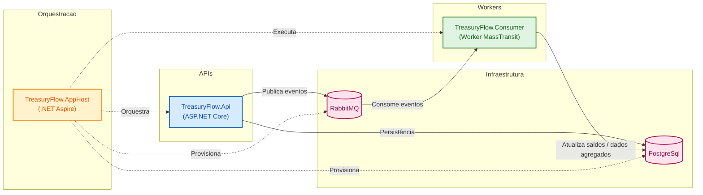

# Treasury Flow

Projeto exemplo para gerenciamento de transações e saldos de usuários.

## Visão geral
O Treasury Flow é um projeto voltado para o gerenciamento de transações financeiras e consulta de saldos diários de usuários, seguindo uma arquitetura baseada em microserviços e separação clara de responsabilidades.

O sistema foi desenhado para atender dois tipos de usuários, cada um com fluxos bem definidos:

👤 Usuário Administrador (Admin / Proprietário)

O administrador é responsável pela gestão e visualização dos dados consolidados do sistema. Seu fluxo principal consiste em:

Criação do próprio registro no sistema.

Autenticação para obtenção de um token JWT.

Consulta agregada dos saldos diários, permitindo visualizar o resultado consolidado das transações realizadas pelos usuários.

Esse fluxo tem como objetivo fornecer uma visão analítica e centralizada dos balances, sem a necessidade de interagir diretamente com as transações individuais.

👤 Usuário Funcionário (Usuário padrão)

O funcionário é o usuário operacional do sistema, responsável pela execução das transações financeiras. Seu fluxo é composto por:

Criação do próprio registro no sistema.

Autenticação para obtenção de um token JWT.

Criação de transações de entrada e saída, que impactam diretamente o saldo do usuário.

As transações criadas pelos funcionários são posteriormente processadas e utilizadas no cálculo dos saldos diários, que ficam disponíveis para consulta pelo administrador.

## Fluxo de negócio


## Sistema
Arquitetura baseada em microserviços/split de responsabilidades com os seguintes componentes principais:

- `src/TreasuryFlow.Api` - API HTTP pública.
- `src/TreasuryFlow.AppHost` - Host de orquestração com `aspire` para execução local distribuída (PostgreSql + RabbitMQ + serviços).
- `src/Workers/TreasuryFlow.Consumer` - Worker (consumer) que processa eventos de transação (MassTransit/RabbitMQ).
- `src/TreasuryFlow.Infrastructure` - Implementações de infra como EF Core, MassTransit, cache e comunicações.
- `src/TreasuryFlow.Application` - Regras de negócio e serviços.
- `src/TreasuryFlow.Domain` - Entidades de domínio.

## Execução local (recomenda-se Aspire CLI)

Este repositório foi pensado para execução local distribuída usando o Aspire (https://aspire.dev/pt-br/get-started/install-cli/).

Pré-requisitos

- É necessário ter um runtime de contêiner disponível localmente para que o `aspire` possa provisionar os serviços (PostgreSql, RabbitMQ, etc.). Instale uma das opções abaixo:
  - Rancher Desktop: https://rancherdesktop.io/
  - Docker Desktop: https://docs.docker.com/desktop/setup/install/windows-install/

  Depois de instalar, verifique se o serviço de contêiner está em execução antes de rodar `aspire run`.

1. Instale a CLI do Aspire seguindo: https://aspire.dev/pt-br/get-started/install-cli/
2. Faça clone do repositório:

   ```bash
   git clone https://github.com/Tmazo/treasury-flow.git
   cd treasury-flow
   ```

3. Execute a aplicação distribuída via `aspire` (exemplo):

   ```bash
   cd src/TreasuryFlow.AppHost
   aspire run
   ```

   Esse comando irá orquestrar os recursos (PostgreSql, RabbitMQ) e iniciar os projetos configurados no `AppHost`.

Passo a passo do sistema (fluxo básico de uso)

1. Registrar um usuário
   - Endpoint: `POST /api/auth/register`
   - Body: `Name`, `Email`, `Password`.

2. Autenticar (gerar token)
   - Endpoint: `POST /api/auth/login`
   - Body: `Email`, `Password`
   - Resultado: objeto com `token` (use no header `Authorization: Bearer {token}`).

3. Criar transação
   - Endpoint: `POST /api/transactions`
   - Requer header `Authorization: Bearer {token}`. (token deve conter user id).
   - Body: payload de criação de transação (veja `src/TreasuryFlow.Api/Transactions/Requests/CreateTransactionRequest.cs`).

4. Ver saldo diário (balance do dia)
   - Endpoint: `GET /api/userbalances` com query `InitialPeriod` e `FinalPeriod` (formato `YYYY-MM-DD`).
   - Requer role `Admin` para passar a policy `ManageUserBalance`.

Dica: os validators e formatos das requests estão em `src/TreasuryFlow.Api` (ex.: validators em `Transactions/Validators` e `UserBalances/Validators`).

## Padrões e bibliotecas usadas

- Clean Code / separação de camadas (Domain / Application / Infrastructure / Api).
- Validação com `FluentValidation` (ex.: validators em `src/TreasuryFlow.Api`).
- Mensageria com `MassTransit` + RabbitMQ (publisher/consumer).
- Persistência com Entity Framework Core (PostgreSql).
- Logging e telemetria com OpenTelemetry (via `ServiceDefaults`).
- Aspire `ServiceDefaults` e `AppHost` para orquestração local de recursos.
- Background services para processamento assíncrono (Worker Service project).

## Endpoints principais

Veja os controladores em `src/TreasuryFlow.Api` (ex.: `TransactionsController`, `UserBalancesController`, `AuthController`).

## Observações de projeto e disclaimers

- Para a consulta do balance diário mantive a agregação no banco usando `GroupBy` com projeção direta para DTOs. A query é stateless, indexável e suficiente para o volume esperado. Caso o volume cresça, a evolução natural sera introduzir um read model específico.
- Este repositório é um ponto de partida; algumas decisões foram tomadas visando simplicidade e clareza para evolução futura.

## Melhorias / Roadmap sugerido

Itens já mapeados e outras sugestões para evolução:

- Adicionar Keycloak (centralizar autenticação/identidade).
- Implementar o padrão Outbox para garantir entrega de eventos de forma transacional.
- Implementar testes E2E integrados usando Aspire.
- Separar o Auth para um microserviço dedicado com banco de dados próprio.
- Implementar cache com Redis para consultas de leitura pesadas.
- Adicionar testes de integração automáticos.
- Introduzir um read-model (CQRS) caso o volume de consultas por dia cresça muito.
- Melhorar observabilidade: dashboards, alertas e tracing configurado para ambientes.
- Harden security: validação de input mais rigorosa, proteção contra rate-limiting e configuração de CORS rígida.
- Adicionar pipelines CI/CD com GitHub Actions e verificação de análise estática (ex.: SonarQube).
 - Criar endpoint para alterar a permissão de um usuário para `Admin` (controle de roles/privileges).
 - Atualmente, o primeiro usuário cadastrado no sistema é automaticamente definido como Administrador `Admin`. Essa abordagem foi adotada por simplicidade e para facilitar o setup inicial do projeto, evitando a necessidade de um fluxo adicional de configuração ou seed manual de dados. Em um cenário futuro, esse processo pode ser evoluído para uma abordagem mais robusta e flexível 

## Diagrama da arquitetura



Explicação da arquitetura

- `TreasuryFlow.Api`: API pública que expõe endpoints REST para criação de transações, consulta de saldos e autenticação. Valida entrada com `FluentValidation` e publica eventos via `MassTransit`/RabbitMQ quando necessário.
- `TreasuryFlow.Consumer`: worker que consome eventos do RabbitMQ (via MassTransit) e realiza processamento assíncrono, por exemplo atualização de saldos agregados.
- `TreasuryFlow.AppHost`: projeto usado com `aspire` para orquestrar recursos em execução local (PostgreSql, RabbitMQ) durante desenvolvimento.
- `PostgreSql`: armazenamento transacional das entidades do domínio (transações, saldos, usuários).
- `RabbitMQ`: barramento de mensagens para comunicação assíncrona entre API e workers.

As cores no diagrama destacam responsabilidades:
- API (azul claro) representa a fronteira HTTP do sistema.
- Consumer (verde claro) é responsável pelo processamento assíncrono em background.
- Infraestrutura de persistência (PostgreSql, em rosa claro) armazena os dados transacionais e agregados.
- Infraestrutura de mensageria (RabbitMQ, em rosa claro) viabiliza a comunicação assíncrona baseada em eventos.
- AppHost / Aspire (amarelo claro) atua na orquestração e provisão dos recursos durante o ambiente de desenvolvimento.

## Busca do balance do dia

Os resultados de consultas são cacheados com uma política que prioriza dados recentes: TTL curto para o dia corrente (30 segundos) e TTL mais longo para períodos anteriores (10 minutos). Essa estratégia reduz carga sobre o banco em leituras repetidas sem sacrificar a frescura dos dados do dia atual.

Recomendações de evolução: caso o volume de leitura ou a necessidade de baixa latência aumentem, considerar introduzir um read model (CQRS) ou materialized views, adicionar cache distribuído (Redis) e adotar o padrão Outbox para garantir consistência entre gravações e publicação de eventos.


---
