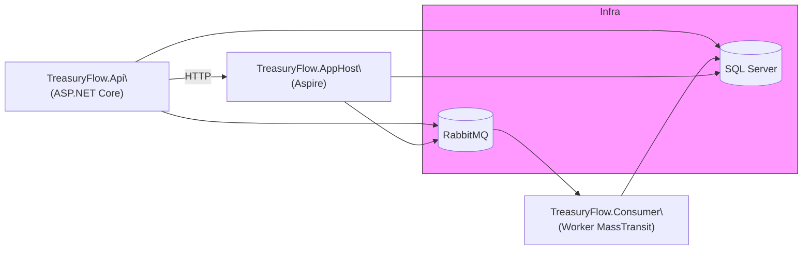

# Treasury Flow

Projeto exemplo para gerenciamento de transações e saldos de usuários.

## Visão geral

Arquitetura baseada em microserviços/split de responsabilidades com os seguintes componentes principais:

- `src/TreasuryFlow.Api` - API HTTP pública.
- `src/TreasuryFlow.AppHost` - Host de orquestração com `aspire` para execução local distribuída (SQL Server + RabbitMQ + serviços).
- `src/Workers/TreasuryFlow.Consumer` - Worker (consumer) que processa eventos de transação (MassTransit/RabbitMQ).
- `src/TreasuryFlow.Infrastructure` - Implementações de infra como EF Core, MassTransit, cache e comunicações.
- `src/TreasuryFlow.Application` - Regras de negócio e serviços.
- `src/TreasuryFlow.Domain` - Entidades de domínio.

## Execução local (recomenda-se Aspire CLI)

Este repositório foi pensado para execução local distribuída usando o Aspire (https://aspire.dev/pt-br/get-started/install-cli/).

1. Instale a CLI do Aspire seguindo: https://aspire.dev/pt-br/get-started/install-cli/
2. Faça clone do repositório:

   ```bash
   git clone https://github.com/Tmazo/treasury-flow.git
   cd treasury-flow
   ```

3. Execute a aplicação distribuída via `aspire` (exemplo):

   ```bash
   cd src/TreasuryFlow.AppHost
   aspire run
   ```

   Esse comando irá orquestrar os recursos (SQL Server, RabbitMQ) e iniciar os projetos configurados no `AppHost`.

Observação: Você também pode executar projetos individualmente via `dotnet run` dentro das pastas de cada projeto para depuração local.

## Padrões e bibliotecas usadas

- Clean Code / separação de camadas (Domain / Application / Infrastructure / Api).
- Validação com `FluentValidation` (ex.: validators em `src/TreasuryFlow.Api`).
- Mensageria com `MassTransit` + RabbitMQ (publisher/consumer).
- Persistência com Entity Framework Core (SQL Server).
- Logging e telemetria com OpenTelemetry (via `ServiceDefaults`).
- Aspire `ServiceDefaults` e `AppHost` para orquestração local de recursos.
- Background services para processamento assíncrono (Worker Service project).

## Endpoints principais

Veja os controladores em `src/TreasuryFlow.Api` (ex.: `TransactionsController`, `UserBalancesController`, `AuthController`).

## Observações de projeto e disclaimers

- Mantive a agregação no banco usando `GroupBy` com projeção direta para DTOs. A query é stateless, indexável e suficiente para o volume esperado. Caso o volume cresça, a evolução natural seria introduzir um read model específico.
- Este repositório é um ponto de partida; algumas decisões foram tomadas visando simplicidade e clareza para evolução futura.

## Melhorias / Roadmap sugerido

Itens já mapeados e outras sugestões para evolução:

- Adicionar Keycloak (centralizar autenticação/identidade).
- Implementar o padrão Outbox para garantir entrega de eventos de forma transacional.
- Implementar testes E2E integrados usando Aspire.
- Separar o Auth para um microserviço dedicado com banco de dados próprio.
- Implementar cache com Redis para consultas de leitura pesadas.
- Adicionar testes unitários e de integração automáticos (CI).
- Introduzir um read-model (CQRS) caso o volume de consultas por dia cresça muito.
- Melhorar observabilidade: dashboards, alertas e tracing configurado para ambientes.
- Harden security: validação de input mais rigorosa, proteção contra rate-limiting e configuração de CORS rígida.
- Adicionar pipelines CI/CD com GitHub Actions e verificação de análise estática (ex.: SonarQube).

## Diagrama da arquitetura



Explicação da arquitetura

- `TreasuryFlow.Api`: API pública que expõe endpoints REST para criação de transações, consulta de saldos e autenticação. Valida entrada com `FluentValidation` e publica eventos via `MassTransit`/RabbitMQ quando necessário.
- `TreasuryFlow.Consumer`: worker que consome eventos do RabbitMQ (via MassTransit) e realiza processamento assíncrono, por exemplo atualização de saldos agregados.
- `TreasuryFlow.AppHost`: projeto usado com `aspire` para orquestrar recursos em execução local (SQL Server, RabbitMQ) durante desenvolvimento.
- `SQL Server`: armazenamento transacional das entidades do domínio (transações, saldos, usuários).
- `RabbitMQ`: barramento de mensagens para comunicação assíncrona entre API e workers.
- `Redis` (opcional): cache para read-heavy endpoints e acelerar consultas agregadas.

As cores no diagrama destacam responsabilidades: API (amarelo claro) para fronteira HTTP, Consumer (azul) para processamento assíncrono, DB (verde) para persistência, Broker (vermelho) para mensageria e Redis (roxo tracejado) como componente opcional de cache.

## Busca do balance do dia

Os resultados de consultas são cacheados com uma política que prioriza dados recentes: TTL curto para o dia corrente (30 segundos) e TTL mais longo para períodos anteriores (10 minutos). Essa estratégia reduz carga sobre o banco em leituras repetidas sem sacrificar a frescura dos dados do dia atual.

Recomendações de evolução: caso o volume de leitura ou a necessidade de baixa latência aumentem, considere introduzir um read model (CQRS) ou materialized views, adicionar cache distribuído (Redis) e adotar o padrão Outbox para garantir consistência entre gravações e publicação de eventos.


---
